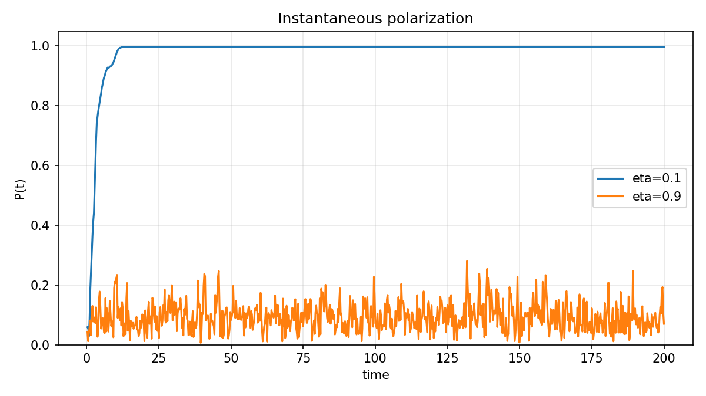
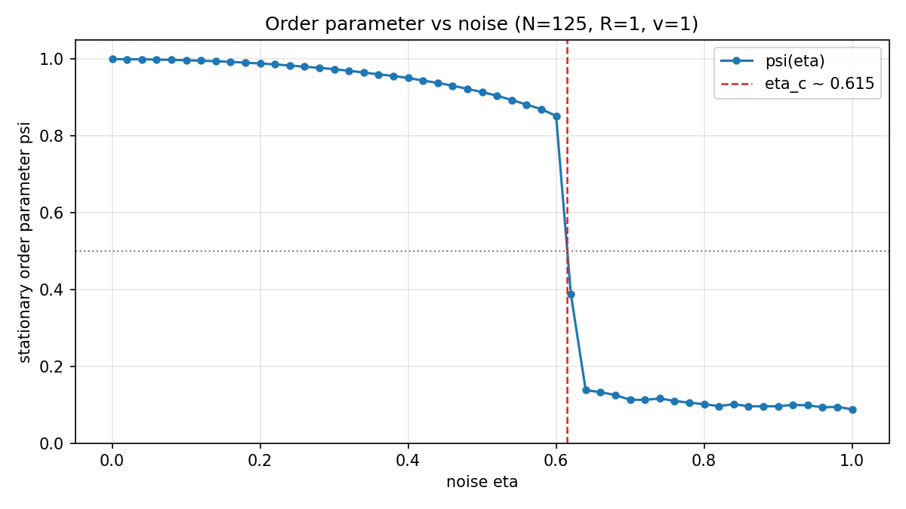
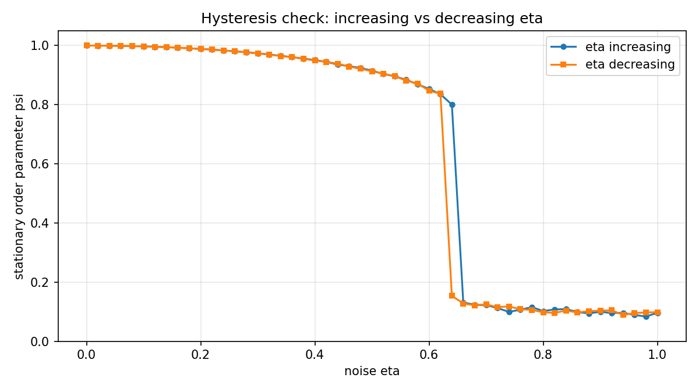
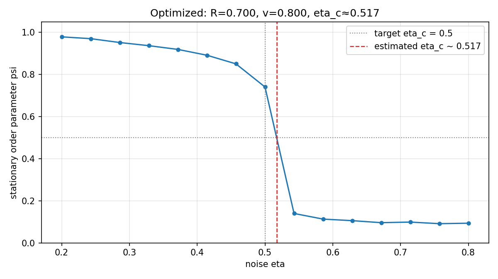

# Particle Interactions — Vicsek Model Report

## Model

I simulated $N=125$ self-propelled particles in a two-dimensional periodic box of side $L=5$ with interaction radius $R$, speed $v$, and time step $\Delta t=0.25$. Each particle has position $\mathbf{r}_i(t)$ and orientation $\Theta_i(t)$. The dynamics follow the assignment equations:

$$\Theta_i(t+\Delta t) = \arg\!\left(\frac{1}{|s_i(t)|}\sum_{j\in s_i(t)} v\,e^{i\Theta_j(t)} + \eta\,e^{i\xi_i(t)}\right)$$

$$\mathbf{r}_i(t+\Delta t) = \mathbf{r}_i(t) + v\,\Delta t\,(\cos\Theta_i(t),\,\sin\Theta_i(t))$$

where $s_i(t)=\{j : |\mathbf{r}_i(t)-\mathbf{r}_j(t)|<R\}$, $\eta\in[0,1]$ is noise strength, and $\xi_i(t)\sim\mathrm{Uniform}(-\pi,\pi)$. The instantaneous polarization is $P(t)=|(1/N)\sum_i e^{i\Theta_i(t)}|$, and the stationary order parameter is $\psi=\langle P(t)\rangle$ after a burn-in period.

## Implementation

The shared engine `vicsek.py` implements minimum-image periodic distances, vectorized neighbor lookup ($O(N^2)$, acceptable for $N=125$), and synchronous updates: all new angles are computed from the old state, and positions advance using the **current** heading $\Theta_i(t)$, not $\Theta_i(t+\Delta t)$. Stationary $\psi$ is estimated by burn-in followed by time-averaged sampling of $P(t)$, with optional averaging over random seeds. Three scripts (`problem1_dynamics.py`, `problem2_phase.py`, `problem3_optimize.py`) generate figures in `outputs/`. Unit tests in `tests/test_vicsek.py` verify polarization bounds, periodic geometry, interpolation of $\eta_c$, and the position-update convention; stochastic transition locations are validated through repeated simulations rather than exact deterministic tests.

## Problem 1: Dynamics at small and large noise

Using default parameters ($R=1$, $v=1$) and the same random initial condition, I compared $\eta=0.1$ (small noise) and $\eta=0.9$ (large noise) over 200 time units.

For $\eta=0.1$, $P(t)$ rises rapidly and remains near 1, indicating strong alignment and flocking. For $\eta=0.9$, $P(t)$ stays low ($\lesssim 0.25$) with large fluctuations, consistent with a disordered state. Snapshot plots at $t=0,50,100,200$ (see `outputs/`) show arrows aligning at low noise and remaining random at high noise.

## Problem 2: Order parameter and phase transition

I swept $\eta\in[0,1]$ and averaged $\psi$ over three seeds per value. At low $\eta$, $\psi\approx 1$; at high $\eta$, $\psi\approx 0.1$. The curve drops sharply near $\eta_c\approx 0.615$ (where $\psi=0.5$), as shown below. This finite-size simulation ($N=125$) exhibits a transition-like discontinuity in $\psi(\eta)$, consistent with a first-order phase transition.

A hysteresis check sweeps $\eta$ upward from an ordered initial state and downward from a random initial state. The two branches overlap at low and high $\eta$ but separate near $\eta\approx 0.62$–$0.64$, with the disordered branch persisting to slightly lower $\eta$ on the decreasing sweep — a small hysteresis loop supporting the first-order picture.

## Problem 3: Optimizing $R$ and $v$ for $\eta_c=0.5$

Because $\psi$ and $\eta_c$ depend on interaction radius and speed, I searched for $(R,v)$ such that the transition occurs near $\eta_c=0.5$. Estimating $\eta_c$ from stochastic simulations is expensive, so I used a **coarse-to-fine grid search** rather than an exhaustive or black-box optimizer:

1. **Coarse:** $5\times 5$ grid over $R\in\{0.3,\ldots,1.5\}$ and $v\in\{0.5,\ldots,1.8\}$, short $\eta$ sweeps, one seed per $(R,v)$.
2. **Refine:** local $5\times 5$ grid around the best coarse point ($\pm 0.2$), longer runs, two seeds.
3. **Validate:** one high-quality $\psi(\eta)$ curve for the winner, three seeds.

The best parameters are **$R=0.70$, $v=0.80$**. Final validation gives **$\eta_c\approx 0.52$** ($|\eta_c-0.5|\approx 0.02$). The search log shows $v\approx 0.8$ consistently minimizes $| \eta_c-0.5|$ across many $R$ values; $R$ is then fine-tuned to $\approx 0.7$.

## Trade-offs, challenges, and validation

**Trade-offs:** I chose brute-force neighbor search for clarity over spatial hashing; seed averaging trades runtime for smoother $\psi(\eta)$ curves; Problem 3's coarse $\eta$ window $[0.25,0.75]$ speeds the search but can miss crossings for extreme $(R,v)$ pairs (penalized in the objective).

**Challenges:** Stochasticity makes $\eta_c$ estimates differ slightly between search and validation phases (e.g. refine $\eta_c\approx 0.503$ vs validation $\approx 0.517$). Finite $N=125$ rounds the transition. An early Problem 3 binary-search approach was prohibitively slow; vectorizing the neighbor sum and switching to per-candidate $\eta$ sweeps reduced runtime to a few minutes.

**Validation:** `pytest -q` passes 10 invariant tests. All problem scripts reproduce the figures cited above.
